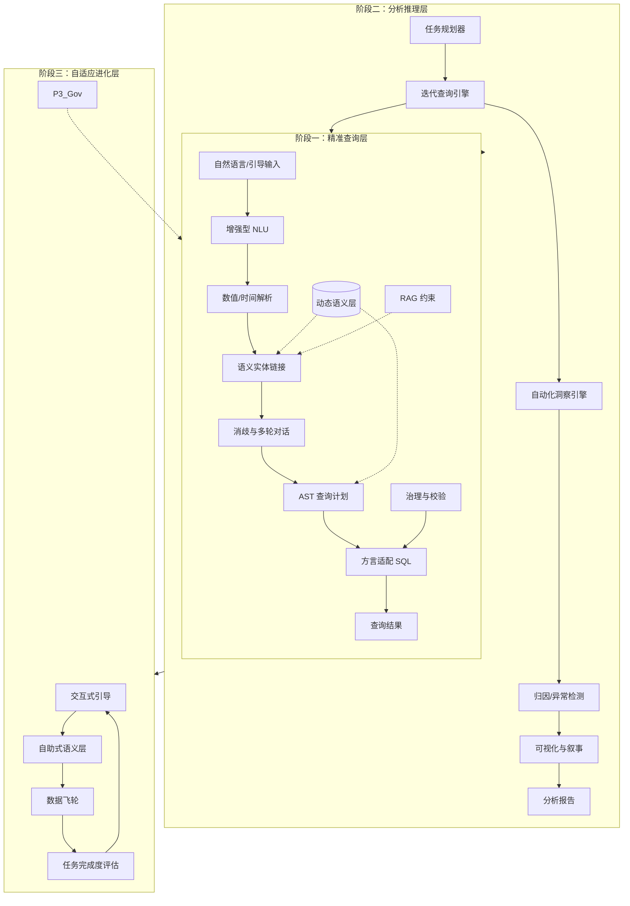

# 问数系统（Text-to-SQL / Text-to-Insight）分阶段架构设计文档

> **文档版本**：v1.0  
> **基于对话上下文总结**：从基础意图识别到深层认知缺陷的完整演进  

---

## 1. 背景与核心挑战

“问数系统”旨在让业务人员通过自然语言（NL）直接查询和分析数据。然而，从自然语言到精准数据查询之间存在巨大鸿沟：

- **自然语言的模糊性**：用户说“销售额”，可能指代 5 种不同口径。
- **数据查询的精确性**：SQL 要求字段、表、关联、聚合完全精确。
- **分析意图的复杂性**：用户真正需要的是“洞察”，而不仅仅是“查询结果”。

这三者构成了问数系统的**“不可能三角”**。任何架构都无法完美同时满足，只能在演进中不断权衡与逼近。

本架构设计文档总结了从**基础意图识别**到**深层认知缺陷**的完整演进过程，提出了一个**三阶段分层架构**，逐步解决工程缺陷、推理缺失和自适应进化问题。

---

## 2. 架构演进与缺陷治理总结

在架构演进过程中，我们识别并解决了三个层次的缺陷：

| 层次 | 核心缺陷 | 解决方案演进 |
| :--- | :--- | :--- |
| **工程架构层** | 实体链接准确率低、多表关联难、无消歧、SQL 字符串拼接、无指标管理 | 引入语义层、AST 查询计划、置信度澄清、RAG 约束 |
| **分析推理层** | 系统只是查询翻译器，缺乏多步推理、归因、洞察能力 | 引入任务规划、迭代查询、自动化洞察引擎 |
| **认知与价值层** | 语义鸿沟、业务口径流动、评估指标错位（SQL 准确率 ≠ 用户价值） | 交互式引导、自助式语义层、数据飞轮、任务完成度评估 |

---

## 3. 三阶段系统架构设计

整体架构分为三个递进的阶段，每个阶段解决不同层次的问题，并向上提供能力支撑。

### 3.1 阶段一：精准查询层（Precision Query Layer）

**目标**：解决工程架构缺陷，实现高准确率的单轮/多轮 SQL 生成。  
**定位**：系统的基石，确保“翻译”准确。

#### 核心模块设计

**1. 动态语义层（Semantic Layer）**  
*替代静态字段映射，引入业务指标管理。*
- **Metric（指标）**：支持原子指标（`SUM(amount)`）、派生指标（`SUM(a)-SUM(b)`）、复合指标（转化率）、窗口指标（排名）。
- **Dimension（维度）**：支持层级（省→市→区）、时间粒度（年/月/日）、枚举值。
- **Entity（实体）**：对应物理表或视图，预定义表间关系（`Relation`），替代实时外键推理。
- **版本控制**：支持指标口径按时间、业务线热切换。

**2. 增强型 NLU 与实体链接**  
- **短语抽取**：中文业务短语识别（如“上个月新客复购率”不切碎）。
- **多策略链接**：
  - 精确匹配（字段名/注释）
  - 同义词库（静态+动态挖掘）
  - 向量语义检索（Embedding 相似度，处理未登录同义）
  - **RAG 约束生成**：将语义层列表注入 LLM Prompt，强制从候选中选择，杜绝幻觉。
- **数值/时间/比较解析器**：独立模块，处理“大于100万”、“最近3个月”等，输出结构化 `Filter` 三元组。

**3. 消歧与多轮对话管理**  
- **置信度分级**：
  - 高（>0.9）：自动确认
  - 中（0.6~0.9）：分数接近时触发澄清反问
  - 低（<0.6）：直接追问或提供候选
- **对话动作识别**：区分新查询、澄清回答、修改（“不对，要不含税的”）、补充（“那按地区呢”）。
- **指代消解**：解析“前者”、“它”等代词，替换为具体实体。
- **栈式上下文**：支持多轮追问和话题回溯。

**4. AST 查询计划生成器**  
*替代字符串拼接，支持复杂 SQL。*
- 构建抽象语法树（`QueryPlan`），包含 `Select`、`From`、`Join`、`Where`、`GroupBy`、`Having`、`Window` 等节点。
- 自动根据语义层 `Relation` 推导 `JOIN` 路径。
- 支持方言渲染（同一 AST 可输出 MySQL/ClickHouse/Hive SQL）。

**5. 治理与校验层**  
- 权限控制（行级/列级）
- SQL 安全校验（防 `DROP`、防全表扫描）
- 查询性能保护（自动加 `LIMIT`、分区过滤）

---

### 3.2 阶段二：分析推理层（Analytical Reasoning Layer）

**目标**：解决“系统只是查询翻译器”的深层次缺陷，从 Text-to-SQL 进化为 Text-to-Insight。  
**定位**：系统的智能核心，提供分析能力。

#### 核心模块设计

**1. 任务规划器（Planning & Reasoning）**  
- 将复杂问题（如“为什么这个月销售额下降”）分解为多步子任务：
  1. 查本月 vs 上月总销售额
  2. 按品类下钻，找下降最大的品类
  3. 按区域下钻，找下降最大的区域
  4. 交叉分析，定位根因

**2. 迭代查询引擎**  
- 循环调用阶段一的查询能力，执行子任务。
- 根据中间结果动态决定下一步查询（如异常检测触发下钻）。

**3. 自动化洞察引擎（AutoInsight）**  
- **归因分析**：计算各维度对指标变化的贡献度（如“华东区手机缺货贡献了 80% 的下降”）。
- **异常检测**：自动识别时间序列中的突变点。
- **对比分析**：同环比、基准对比。

**4. 可视化与叙事生成**  
- 自动推荐图表类型（趋势用线图、占比用饼图）。
- 生成自然语言叙事（“本月销售额下降 15%，主要原因是…”），输出分析报告。

---

### 3.3 阶段三：自适应进化层（Adaptive Evolution Layer）

**目标**：解决语义鸿沟、业务流动性、评估错位等认知层缺陷，实现系统自进化。  
**定位**：系统的生态与闭环，确保长期价值。

#### 核心模块设计

**1. 交互式引导与结构化输入**  
- 承认自然语言模糊性的客观存在，不追求“任意 NL 查询”。
- 提供引导式输入：指标推荐、维度快捷筛选、时间选择器。
- 自然语言作为辅助，而非唯一入口。

**2. 自助式语义层**  
- 将指标/维度定义权下放给业务方（数据产品经理/分析师）。
- 系统提供托管、版本管理、血缘影响分析。
- 支持业务方自定义同义词、口径表达式。

**3. 数据飞轮（Feedback Flywheel）**  
- **反馈采集**：用户对澄清的选择、对 SQL 的修改、对结果的赞踩。
- **自动沉淀**：
  - 新同义词自动写入向量库。
  - 指标修改自动更新语义层版本。
  - 高频查询模式自动优化缓存。
- **模型迭代**：定期用积累的标注数据微调链接模型和 LLM Prompt。

**4. 任务完成度评估体系**  
- 废弃单一的“SQL 执行准确率”指标。
- 引入**任务完成度**：用户是否因系统回答而做出了决策？是否节省了时间？
- 全链路跟踪：从提问 → 澄清 → 查询 → 洞察 → 决策。

---

## 4. 整体架构图（Mermaid）



---

## 5. 核心数据结构定义（概要）

```python
# 语义层核心模型
class Metric:
    id: str
    name: str
    synonyms: list[str]
    expr: str                  # 逻辑表达式
    metric_type: Enum          # ATOMIC, DERIVED, COMPOSITE, WINDOW
    allowed_dimensions: list[str]
    version: str

class Dimension:
    id: str
    name: str
    synonyms: list[str]
    expr: str
    hierarchy: list[str]       # 层级关系
    time_granularity: str      # year/month/day

class Entity:
    id: str
    physical_table: str
    metrics: list[Metric]
    dimensions: list[Dimension]
    relations: list[Relation]  # 预定义关联

# 查询计划 AST 节点
class QueryPlan:
    select: list[SelectExpr]
    from_table: str
    joins: list[JoinExpr]
    where: list[Condition]
    group_by: list[str]
    having: list[Condition]
    order_by: list[OrderBy]
    limit: int
    ctes: list[CTE]           # 支持 CTE

# 对话状态
class DialogueState:
    session_id: str
    confirmed_intent: dict    # 已确认槽位
    pending_clarifications: list[Clarification]
    history: list[dict]
```

---

## 6. 技术选型建议

| 模块 | 推荐技术 |
| :--- | :--- |
| **语义层存储** | YAML/JSON + 关系型数据库（版本控制） |
| **向量检索** | FAISS / Milvus + BGE 等 Embedding 模型 |
| **AST 处理** | `sqlglot` 库（支持多方言解析和生成） |
| **LLM 集成** | 通过 Function Calling 输出结构化 JSON，约束生成 |
| **数值/时间解析** | 基于规则或 `Duckling` 类库 |
| **对话管理** | 状态机 + 规则/LLM 混合 |
| **数据飞轮** | 消息队列（Kafka） + 离线处理管道 |

---

## 7. 落地路线建议

1. **第一周**：定义 20 个核心指标和 10 个维度，搭建动态语义层，跑通阶段一的实体链接和单表查询。
2. **第二周**：实现 AST 查询计划生成器和多表 JOIN 推导，支持复杂 SQL。
3. **第三周**：加入消歧与多轮对话，接入 RAG 约束防止 LLM 幻觉。
4. **第四周**：构建迭代查询引擎，实现简单的归因分析（阶段二起步）。
5. **持续迭代**：收集用户反馈，启动数据飞轮，逐步完善自助语义层。

---

## 8. 总结

本架构设计文档从**意图识别输出格式**出发，逐步演进到**语义层管理**、**AST 查询计划**、**多轮对话消歧**，并最终上升到**分析推理**和**自适应进化**。它承认了问数系统的“不可能三角”，并通过分层架构在不同阶段解决不同层次的问题：

- **阶段一**确保“查得准”。
- **阶段二**确保“看得懂”（洞察）。
- **阶段三**确保“用得好”（自进化）。

这不是一个可以一蹴而就的系统，而是一个需要**持续迭代、数据与业务双轮驱动**的长期工程。
